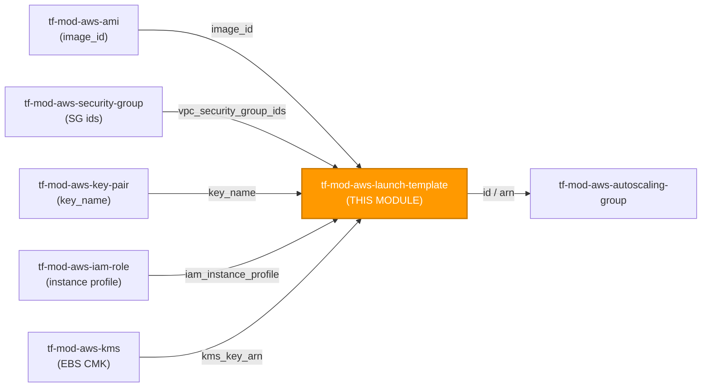
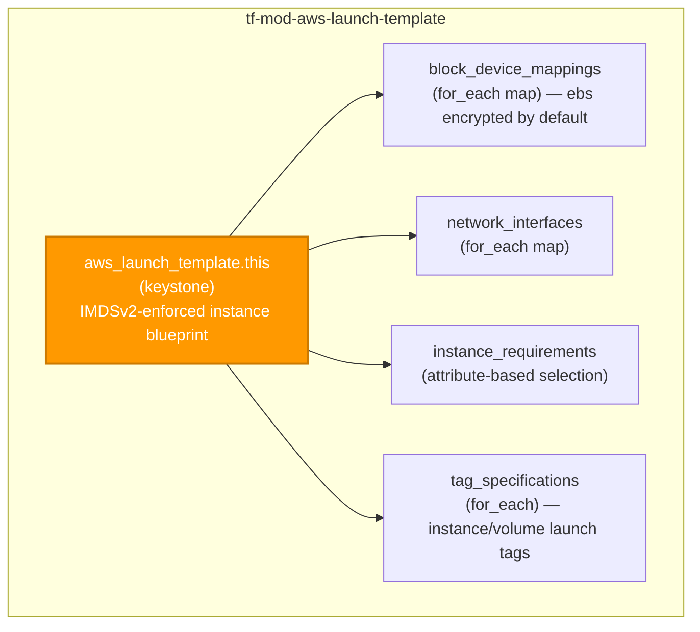

# 🚀 AWS **Launch Template** Terraform Module

> **Defines a single, secure-by-default `aws_launch_template` — the reusable instance blueprint consumed by Auto Scaling groups, EC2 Fleet, Spot Fleet, and `aws_instance`.** IMDSv2 enforced, EBS encryption ON by default, governance tags propagated to launched instances and volumes, and the full v6.x argument surface deeply typed. Built for the AWS provider **v6.x**.

[](https://www.terraform.io)
[](https://registry.terraform.io/providers/hashicorp/aws/latest)
[](#)
[](#)
[](#)

---

## 🧩 Overview

- 📋 **One launch template, fully typed.** Creates a single `aws_launch_template.this` exposing the complete v6.x argument surface — block device mappings, network interfaces, instance requirements, placement, CPU/credit/enclave/hibernation/maintenance options, capacity reservations, and spot market options — as deeply-typed `object` schemas with baked-in defaults.
- 🔒 **IMDSv2 enforced by default.** `metadata_options` defaults to session tokens **required** and a **hop limit of 1**, so the metadata service can't be reached from a container or proxied off-box. Relax only with a documented exception.
- 🛡️ **EBS encryption ON by default.** Every `block_device_mappings[*].ebs` block defaults to `encrypted = "true"`; supply a customer-managed CMK via `kms_key_arn` (or per-volume `kms_key_id`) for auditable, revocable key access on PII-bearing hosts.
- 🌐 **Private by default.** Network-interface `associate_public_ip_address` is left unset — instances launched from the template stay private unless a public address is explicitly requested. SSM Session Manager is the preferred keyless access path.
- 🏷️ **Governance tags propagate to launches.** Provider `default_tags` are **not** propagated to ASG/launch-created resources, so `propagate_tags` (default `true`) seeds `var.tags` onto the `instance` and `volume` tag specifications — launched resources carry the same tags as the template.
- 🧩 **Consumes, doesn't create.** AMI, security groups, key pair, instance profile, CMK, subnet, placement group, and capacity reservation are all referenced from sibling modules.
- 🔁 **Stable child collections.** Block device mappings, network interfaces, and secondary interfaces use `for_each` over `map(object)` keyed by a caller string (never `count`), so reorders don't churn the plan.
- 🌍 **Region-inherited.** No `region` variable — the caller's provider sets the Region.

> 💡 **Why it matters:** A launch template is the single point where instance security posture is decided for an entire fleet. Centralizing IMDSv2, encrypted EBS, private networking, and consistent governance tagging here makes the hardened baseline the *default* for every ASG and fleet across the estate — not a per-team checklist.

---

## ❤️ Support this project

If these Terraform modules have been helpful to you or your organization, I'd appreciate your support in any of the following ways:

- ⭐ **Star this repository** to help others discover this Terraform module.
- 🤝 **Connect with me on LinkedIn:** [linkedin.com/in/microsoftexpert](https://www.linkedin.com/in/microsoftexpert)
- ☕ **Buy me a coffee:** [buymeacoffee.com/microsoftexpert](https://buymeacoffee.com/microsoftexpert)

Whether it's a star, a professional connection, or a coffee, every gesture helps keep these modules actively maintained and continually improving. Thank you for being part of the community!

---

## 🗺️ Where this fits in the family

`tf-mod-aws-launch-template` is a **compute-blueprint hub** — it consumes AMI, security-group, key-pair, IAM-role, and KMS references from sibling modules and is, in turn, consumed by anything that launches instances from it.



This module **consumes** AMI, security-group, key-pair, IAM-role, KMS, subnet, and placement-group references (from their respective `tf-mod-aws-*` modules); it **emits** `id` / `arn` / `name` for `tf-mod-aws-autoscaling-group`, EC2/Spot Fleet, and `aws_instance` — see the [Typical wiring](#-typical-wiring) table.

---

## 🧬 What this module builds

A single `aws_launch_template.this` keystone whose optional child collections (`for_each` over `map(object)`, never `count`) render only when the caller supplies them.



| Resource / block | Count | Created when |
|---|---|---|
| `aws_launch_template.this` | 1 | always (keystone) |
| `block_device_mappings` | 0..n | caller supplies `var.block_device_mappings` entries |
| `network_interfaces` | 0..n | caller supplies `var.network_interfaces` entries |
| `tag_specifications` | 0..n | `propagate_tags = true` (default) and/or caller supplies `var.tag_specifications` |

---

## 📁 Module Structure

```text
tf-mod-aws-launch-template/
├── providers.tf # required_providers (aws >= 6.0, < 7.0); no provider {} block
├── variables.tf # deeply-typed inputs, validation, secure defaults
├── main.tf # aws_launch_template.this + tag-propagation locals
├── outputs.tf # id, arn, name, latest_version, default_version, tags_all
├── README.md # this file
└── SCOPE.md # resource scope, IAM permissions, prerequisites, gotchas
```

---

## ⚙️ Quick Start

Smallest working call, wiring upstream modules:

```hcl
module "app_launch_template" {
  source = "git::https://github.com/microsoftexpert/tf-mod-aws-launch-template?ref=v1.0.0"

  name          = "app-tier"
  image_id      = module.app_ami.id # from tf-mod-aws-ami
  instance_type = "m6i.large"

  vpc_security_group_ids = [module.app_sg.id] # from tf-mod-aws-security-group

  iam_instance_profile = {
    arn = module.app_role.instance_profile_arn # from tf-mod-aws-iam-role
  }

  kms_key_arn = module.ebs_cmk.arn # from tf-mod-aws-kms

  block_device_mappings = {
    root = {
      device_name = "/dev/xvda"
      ebs = {
        volume_size = 50
        volume_type = "gp3"
        # encrypted = "true" is the default; kms_key_id falls back to kms_key_arn
      }
    }
  }

  tags = {
    Environment = "prod"
    CostCenter  = "1234"
    DataClass   = "PII"
  }
}
```

> ⚠️ Always pin the source with `?ref=v1.0.0` — never a branch.

---

## 🔑 Required IAM Permissions

Least-privilege actions the **Terraform execution identity** needs to manage this resource. A launch template only *stores* an instance specification — it never calls `RunInstances` — so the create/update/delete permissions are narrow.

| Action | Required for | Notes |
|---|---|---|
| `ec2:CreateLaunchTemplate` | Creating the template | Resource-level tag conditions (`aws:ResourceTag/*`, `ec2:CreateAction`) can scope this. |
| `ec2:CreateLaunchTemplateVersion` | New versions on every change | Each apply that mutates the spec creates a new version. |
| `ec2:ModifyLaunchTemplate` | `default_version` / `update_default_version` | Promotes a version to the default. |
| `ec2:DeleteLaunchTemplate` | Destroy | — |
| `ec2:DeleteLaunchTemplateVersions` | Pruning versions | Used on update/destroy paths. |
| `ec2:DescribeLaunchTemplates`, `ec2:DescribeLaunchTemplateVersions` | Plan / refresh | Read-only; cannot be resource-scoped. |
| `ec2:CreateTags`, `ec2:DeleteTags` | Tagging the template + `tag_specifications` | Scope with `ec2:CreateAction = CreateLaunchTemplate`. |

> ℹ️ **`iam:PassRole` is NOT required here.** Storing an `iam_instance_profile` reference in a launch template does not pass the role — `iam:PassRole` (scoped to the role ARN, conditioned `iam:PassedToService = ec2.amazonaws.com`) is enforced later, against the **consumer** (`RunInstances`, the ASG service-linked role, or `aws_instance`). Likewise, **KMS permissions are not needed by the template creator** — the CMK is only referenced as a string; the EBS grant (`kms:CreateGrant`, `kms:GenerateDataKeyWithoutPlaintext`) happens at instance-launch time and is the consumer's concern.

> ⚠️ **No resource-level restriction on referenced resources.** You cannot use resource-level permissions to restrict which AMIs, security groups, or profiles a principal embeds in a template. Grant `ec2:CreateLaunchTemplate` only to trusted administrators.

---

## 📋 AWS Prerequisites

- **No service-linked role** is required to create a launch template itself. (The *consumer* — EC2 Auto Scaling — uses the `AWSServiceRoleForAutoScaling` SLR, which Terraform auto-creates with the ASG, not here.)
- **Referenced resources must exist and be Region-local:** `image_id` (AMIs are Region-scoped), `vpc_security_group_ids` / per-interface `security_groups`, `key_name`, `iam_instance_profile`, and any `capacity_reservation` / `placement` group must live in the target Region/VPC.
- **CMK (optional):** when `kms_key_arn` (or a per-volume `kms_key_id`) is supplied, the key's policy must allow the EC2/EBS service to use it at launch (`kms:CreateGrant`, `kms:GenerateDataKeyWithoutPlaintext`). This is validated at instance launch, not at template creation.
- **Quotas:** default **5,000 launch templates per Region** and **10,000 versions per template** (both adjustable via Service Quotas). Instance-type vCPU quotas apply to the *consumer* at launch, not to the template.
- **Region:** EC2 launch templates are a regional resource — **no `us-east-1` global-service constraint**.

---

## 🔌 Typical wiring

How this module's outputs connect to the rest of the library — one row per output in `outputs.tf`.

| This module output | Feeds into |
|---|---|
| `id` | `tf-mod-aws-autoscaling-group` (`launch_template.id`), EC2 Fleet / Spot Fleet, and `aws_instance.launch_template` references |
| `arn` | `tf-mod-aws-iam-policy` (resource-level `ec2:RunInstances` conditions), resource-based permissions |
| `name` | ASG / fleet references that target the template by name |
| `latest_version` | Consumers pinning to a specific revision instead of `"$Latest"` |
| `default_version` | Consumers that reference `"$Default"` |
| `tags_all` | Governance / audit tooling, cost allocation |

---

## 🧠 Architecture Notes

- **`id` format:** `lt-0123456789abcdef0`. **`arn` format:** `arn:aws:ec2:<region>:<account-id>:launch-template/lt-...` — the ARN is the cross-resource reference type for IAM policy `Resource` blocks and resource-level conditions.
- **Versioning, not replacement.** Most spec changes create a **new version** of the same template (the `id`/`arn` are stable). Consumers that reference the template by `id` and track `"$Latest"`/`"$Default"` pick up changes without being recreated. `latest_version` increments on every change.
- **FORCE-NEW fields:** `name` and `name_prefix` are the only replacement triggers. Changing `name` destroys and recreates the template (new `id`/`arn`), which bumps any consumer referencing it by name. Prefer a stable explicit `name`, or use `name_prefix` with create-before-destroy when each revision must be uniquely named.
- **String-typed "booleans".** The launch-template API distinguishes *unset* from *false*, so several fields are **strings**, not booleans: `ebs_optimized`, `block_device_mappings[*].ebs.{encrypted,delete_on_termination}`, and `network_interfaces[*].{associate_public_ip_address,associate_carrier_ip_address,delete_on_termination,primary_ipv6}` all take `"true"` / `"false"`. Validations enforce this.
- **`tags` ↔ `tags_all` ↔ `default_tags`.** `var.tags` flows to `aws_launch_template.this.tags`; `tags_all` is the computed merge of resource tags over provider `default_tags` (**resource tags win** on key conflict). `default_tags` is the caller's provider-block concern, never set in the module.
- **`tags` vs `tag_specifications` — a key distinction.** `var.tags` tags the *template object*. `tag_specifications` tag the *instances/volumes launched from* the template. Because provider `default_tags` are **not** propagated to ASG/launch-created resources, `propagate_tags = true` (default) seeds `var.tags` onto the `instance` and `volume` resource types; caller-supplied `tag_specifications` win on key conflict, and empty tag maps are dropped.
- **Mutually-exclusive inputs** (enforced by validations): `name` ⊕ `name_prefix`; `instance_type` ⊕ `instance_requirements`; `default_version` ⊕ `update_default_version`; `vpc_security_group_ids` ⊕ per-interface `security_groups`; `iam_instance_profile.{arn,name}`; `placement.{group_id,group_name}`.
- **Eventual consistency.** A newly created template can take a moment to be visible to a consuming ASG/fleet in the same apply — Terraform's dependency graph generally orders this correctly when you wire `id` directly.
- **Destroy ordering.** A launch template cannot be deleted while an ASG, fleet, or instance still references it. Destroy the consumers first (or let Terraform's graph order it when both are managed in the same configuration).

---

## 📚 Example Library (copy-paste)

<details><summary><strong>1 · Minimal</strong></summary>

```hcl
module "lt" {
  source        = "git::https://github.com/microsoftexpert/tf-mod-aws-launch-template?ref=v1.0.0"
  name          = "minimal"
  image_id      = "ami-0123456789abcdef0"
  instance_type = "t3.micro"
}
```
</details>

<details><summary><strong>2 · With tags (merge with provider <code>default_tags</code>)</strong></summary>

```hcl
# Provider (caller side) sets baseline default_tags:
# provider "aws" { default_tags { tags = { Owner = "platform", ManagedBy = "terraform" } } }

module "lt" {
  source        = "git::https://github.com/microsoftexpert/tf-mod-aws-launch-template?ref=v1.0.0"
  name          = "tagged"
  image_id      = "ami-0123456789abcdef0"
  instance_type = "m6i.large"

  tags = {
    Environment = "prod" # wins over default_tags on key conflict
    DataClass   = "PII"
  }
}
# tags_all = { Owner, ManagedBy, Environment, DataClass }
# Because propagate_tags = true (default), tags are also seeded onto launched instances/volumes.
```
</details>

<details><summary><strong>3 · Customer-managed KMS key for EBS (module-level CMK)</strong></summary>

```hcl
module "lt" {
  source        = "git::https://github.com/microsoftexpert/tf-mod-aws-launch-template?ref=v1.0.0"
  name          = "cmk-root"
  image_id      = "ami-0123456789abcdef0"
  instance_type = "m6i.large"

  kms_key_arn = module.ebs_cmk.arn # from tf-mod-aws-kms — fallback CMK for all ebs blocks

  block_device_mappings = {
    root = {
      device_name = "/dev/xvda"
      ebs = {
        volume_size = 100
        # encrypted = "true" (default); kms_key_id falls back to var.kms_key_arn
      }
    }
  }
}
```
</details>

<details><summary><strong>4 · Per-volume CMK override</strong></summary>

```hcl
module "lt" {
  source        = "git::https://github.com/microsoftexpert/tf-mod-aws-launch-template?ref=v1.0.0"
  name          = "data-tier"
  image_id      = "ami-0123456789abcdef0"
  instance_type = "r6i.xlarge"
  kms_key_arn   = module.default_cmk.arn

  block_device_mappings = {
    root = {
      device_name = "/dev/xvda"
      ebs         = { volume_size = 50 } # uses default_cmk
    }
    data = {
      device_name = "/dev/sdf"
      ebs = {
        volume_size = 500
        volume_type = "io2"
        iops        = 16000
        kms_key_id  = module.npi_cmk.arn # per-volume override wins
      }
    }
  }
}
```
</details>

<details><summary><strong>5 · ⚠️ Secure-by-default opt-out — IMDSv1 allowed (EXCEPTION, requires sign-off)</strong></summary>

```hcl
# Documented exception ONLY — IMDSv1 (http_tokens = "optional") widens SSRF/credential-theft
# exposure. baseline is IMDSv2 required. Record the exception and compensating controls.
module "lt" {
  source        = "git::https://github.com/microsoftexpert/tf-mod-aws-launch-template?ref=v1.0.0"
  name          = "legacy-imds"
  image_id      = "ami-0123456789abcdef0"
  instance_type = "t3.medium"

  metadata_options = {
    http_tokens                 = "optional" # ← exception: re-enables IMDSv1
    http_put_response_hop_limit = 2          # ← exception: reachable from containers
  }
}
```
</details>

<details><summary><strong>6 · ⚠️ Secure-by-default opt-out — unencrypted EBS (EXCEPTION)</strong></summary>

```hcl
# Documented exception ONLY. baseline encrypts every EBS block. Use solely for a
# volume that legitimately cannot be encrypted (e.g. restoring from an unencrypted snapshot).
module "lt" {
  source        = "git::https://github.com/microsoftexpert/tf-mod-aws-launch-template?ref=v1.0.0"
  name          = "from-snapshot"
  image_id      = "ami-0123456789abcdef0"
  instance_type = "m6i.large"

  block_device_mappings = {
    restore = {
      device_name = "/dev/sdf"
      ebs = {
        snapshot_id = "snap-0123456789abcdef0"
        encrypted   = "false" # ← exception: cannot combine encrypted with an unencrypted snapshot
      }
    }
  }
}
```
</details>

<details><summary><strong>7 · Attribute-based instance selection (<code>instance_requirements</code>)</strong></summary>

```hcl
# Mutually exclusive with instance_type. memory_mib.min and vcpu_count.min are required.
module "lt" {
  source   = "git::https://github.com/microsoftexpert/tf-mod-aws-launch-template?ref=v1.0.0"
  name     = "abis"
  image_id = "ami-0123456789abcdef0"

  instance_requirements = {
    memory_mib            = { min = 8192 }
    vcpu_count            = { min = 2, max = 8 }
    cpu_manufacturers     = ["intel", "amd"]
    burstable_performance = "excluded"
    instance_generations  = ["current"]
  }
}
```
</details>

<details><summary><strong>8 · Spot market options</strong></summary>

```hcl
module "lt" {
  source        = "git::https://github.com/microsoftexpert/tf-mod-aws-launch-template?ref=v1.0.0"
  name          = "spot-workers"
  image_id      = "ami-0123456789abcdef0"
  instance_type = "c6i.large"

  instance_market_options = {
    market_type = "spot"
    spot_options = {
      max_price                      = "0.05"
      spot_instance_type             = "one-time"
      instance_interruption_behavior = "terminate"
    }
  }
}
```
</details>

<details><summary><strong>9 · Explicit network interface (primary, private)</strong></summary>

```hcl
module "lt" {
  source        = "git::https://github.com/microsoftexpert/tf-mod-aws-launch-template?ref=v1.0.0"
  name          = "eni-primary"
  image_id      = "ami-0123456789abcdef0"
  instance_type = "m6i.large"

  network_interfaces = {
    eth0 = {
      device_index          = 0
      delete_on_termination = "true"
      security_groups       = [module.app_sg.id] # use this OR vpc_security_group_ids, not both
      # associate_public_ip_address left unset → instance stays private
    }
  }
}
```
</details>

<details><summary><strong>10 · IAM instance profile + detailed monitoring + IMDS tags</strong></summary>

```hcl
module "lt" {
  source        = "git::https://github.com/microsoftexpert/tf-mod-aws-launch-template?ref=v1.0.0"
  name          = "observable"
  image_id      = "ami-0123456789abcdef0"
  instance_type = "m6i.large"

  iam_instance_profile = { name = module.app_role.instance_profile_name }
  monitoring           = { enabled = true }

  metadata_options = {
    instance_metadata_tags = "enabled" # expose tags via IMDS (still IMDSv2-required)
  }
}
```
</details>

<details><summary><strong>11 · user_data (base64-encoded; no secrets)</strong></summary>

```hcl
module "lt" {
  source        = "git::https://github.com/microsoftexpert/tf-mod-aws-launch-template?ref=v1.0.0"
  name          = "bootstrap"
  image_id      = "ami-0123456789abcdef0"
  instance_type = "t3.medium"

  user_data = base64encode(file("${path.module}/userdata.sh"))
  # NEVER place secrets in user_data — it is readable from the instance metadata service.
}
```
</details>

<details><summary><strong>12 · SSM-resolved AMI + key pair</strong></summary>

```hcl
module "lt" {
  source        = "git::https://github.com/microsoftexpert/tf-mod-aws-launch-template?ref=v1.0.0"
  name          = "ssm-ami"
  image_id      = "resolve:ssm:/aws/service/ami-amazon-linux-latest/al2023-ami-kernel-default-x86_64"
  instance_type = "m6i.large"
  key_name      = module.bastion_key.key_name # from tf-mod-aws-key-pair (SSM preferred otherwise)
}
```
</details>

<details><summary><strong>13 · Tag only the template, not launched resources (<code>propagate_tags = false</code>)</strong></summary>

```hcl
module "lt" {
  source         = "git::https://github.com/microsoftexpert/tf-mod-aws-launch-template?ref=v1.0.0"
  name           = "template-only-tags"
  image_id       = "ami-0123456789abcdef0"
  instance_type  = "m6i.large"
  propagate_tags = false # var.tags stay on the template object only

  tags = { Team = "platform" }

  tag_specifications = {
    instance = { Name = "worker", Backup = "daily" } # explicit launch-time tags
  }
}
```
</details>

<details><summary><strong>14 · Full cross-module composition (ASG-ready)</strong></summary>

```hcl
module "lt" {
  source        = "git::https://github.com/microsoftexpert/tf-mod-aws-launch-template?ref=v1.0.0"
  name          = "app-tier"
  image_id      = module.app_ami.id # tf-mod-aws-ami
  instance_type = "m6i.large"

  vpc_security_group_ids = [module.app_sg.id]                             # tf-mod-aws-security-group
  iam_instance_profile   = { arn = module.app_role.instance_profile_arn } # tf-mod-aws-iam-role
  kms_key_arn            = module.ebs_cmk.arn                             # tf-mod-aws-kms

  block_device_mappings = {
    root = { device_name = "/dev/xvda", ebs = { volume_size = 50 } }
  }

  tags = { Environment = "prod", DataClass = "PII" }
}

module "asg" {
  source = "git::https://github.com/microsoftexpert/tf-mod-aws-autoscaling-group?ref=v1.0.0"
  #...
  launch_template = {
    id      = module.lt.id
    version = "$Latest"
  }
  vpc_zone_identifier = module.vpc.private_subnet_ids # tf-mod-aws-vpc
}
```
</details>

---

## 📥 Inputs (high-level)


- **Identity:** `name` (FORCE-NEW), `name_prefix` (FORCE-NEW), `description`.
- **Core launch config:** `image_id`, `instance_type`, `key_name`, `user_data`, `vpc_security_group_ids`, `security_group_names`, `ebs_optimized`, `disable_api_stop`, `disable_api_termination`, `instance_initiated_shutdown_behavior`, `kernel_id`, `ram_disk_id`, `default_version`, `update_default_version`.
- **Encryption:** `kms_key_arn` (module-level fallback CMK for EBS blocks).
- **Storage:** `block_device_mappings` (`map(object)`, EBS encryption ON by default).
- **Metadata / security:** `metadata_options` (IMDSv2-required default).
- **Monitoring / IAM:** `monitoring`, `iam_instance_profile`.
- **Placement / CPU:** `placement`, `cpu_options`, `credit_specification`.
- **Lifecycle / hardware:** `enclave_options`, `hibernation_options`, `maintenance_options`, `network_performance_options`, `private_dns_name_options`.
- **Capacity / market:** `capacity_reservation_specification`, `instance_market_options`, `license_specification_arns`.
- **Instance selection:** `instance_requirements` (mutually exclusive with `instance_type`).
- **Networking:** `network_interfaces` (`map(object)`), `secondary_interfaces` (`map(object)`).
- **Tagging:** `tag_specifications`, `propagate_tags`, `tags`.

---

## 🧾 Outputs

- **`id`** — the launch template id (`lt-...`).
- **`arn`** — the launch template ARN (cross-resource reference type).
- **`name`** — the template name (explicit, prefix-generated, or AWS auto-generated).
- **`latest_version`** — latest version number; increments on every change.
- **`default_version`** — default version number consumers resolve via `"$Default"`.
- **`tags_all`** — all tags including provider `default_tags` (resource tags win). No `sensitive` outputs are emitted by this module.

---

## 🧱 Design Principles

Secure-by-default posture and the variable that relaxes each hardened default:

- 🔒 **IMDSv2 required** — `metadata_options.http_tokens = "required"`, `http_put_response_hop_limit = 1`. *Opt-out:* set `http_tokens = "optional"` / a higher hop limit (documented exception only).
- 🛡️ **EBS encryption ON** — every `block_device_mappings[*].ebs.encrypted` defaults to `"true"`. *Opt-out:* set `encrypted = "false"` per volume (documented exception only).
- 🔑 **Caller-supplied CMK supported** — `kms_key_arn` defaults to `null` (AWS-managed `aws/ebs` key); supply a CMK for auditable, revocable encryption. Per-volume `kms_key_id` overrides the module default.
- 🌐 **Private networking by default** — `associate_public_ip_address` left unset. *Opt-out:* set `"true"` on a network interface.
- 🏷️ **Governance tags propagate to launches** — `propagate_tags = true` seeds `var.tags` onto launched instances/volumes (because `default_tags` are not propagated). *Opt-out:* `propagate_tags = false`.
- 🚫 **No credentials, no region variable** — credentials resolve through the standard AWS chain at the provider level; Region is inherited from the provider.
- 🧱 **Deeply-typed, validated inputs** — `object` schemas, `optional` defaults, and `validation {}` blocks on every enum and mutually-exclusive pair; `for_each` over `map(object)` for all child collections (never `count`).

---

## 🚀 Runbook

```bash
terraform init -backend=false
terraform validate
terraform fmt -check
terraform plan # requires valid AWS credentials (profile / SSO / OIDC) + a region
terraform apply
terraform output
```

> ⚠️ Pin the module source with `?ref=v1.0.0`, never a branch. `plan`/`apply` require valid AWS credentials and a configured Region; `init -backend=false` / `validate` / `fmt -check` do not.

---

## 🧪 Testing

- `terraform init -backend=false && terraform validate` — schema and type correctness.
- `terraform fmt -check` — formatting.
- `terraform plan` against a sandbox account to confirm secure defaults render (IMDSv2 required, EBS `encrypted = "true"`, propagated tag specifications) before promoting to a shared/ASG configuration.

---

## 💬 Example Output

```text
Apply complete! Resources: 1 added, 0 changed, 0 destroyed.

Outputs:

arn = "arn:aws:ec2:us-east-1:111122223333:launch-template/lt-0abc123def4567890"
default_version = 1
id = "lt-0abc123def4567890"
latest_version = 1
name = "app-tier"
tags_all = {
 "DataClass" = "PII"
 "Environment" = "prod"
 "ManagedBy" = "terraform"
}
```

---

## 🔍 Troubleshooting

- **Tag drift / "tags keep changing".** Overlap between `var.tags` and provider `default_tags` is resolved with resource tags winning — `tags_all` shows the merge. If launched instances are missing tags, remember `default_tags` are **not** propagated to launch-created resources; rely on `propagate_tags` (default `true`) or explicit `tag_specifications`.
- **`UnauthorizedOperation` on create.** The Terraform identity is missing `ec2:CreateLaunchTemplate` / `ec2:CreateLaunchTemplateVersion` / `ec2:CreateTags`. Note these can be restricted by tag conditions — check `aws:ResourceTag/*` and `ec2:CreateAction` in the policy.
- **`iam:PassRole` denied — but only when an ASG/instance launches.** The template stores the profile fine; the failure surfaces at `RunInstances`. Grant the **consumer** `iam:PassRole` on the role ARN (`iam:PassedToService = ec2.amazonaws.com`), not the template creator.
- **EBS encryption / KMS errors at launch.** Again a consumer-side failure: the CMK policy must allow `kms:CreateGrant` and `kms:GenerateDataKeyWithoutPlaintext` for the EC2/EBS service. The template only stores the key reference.
- **"encrypted cannot be set with snapshot_id."** Restoring from an unencrypted snapshot conflicts with `encrypted = "true"`. Set `encrypted = "false"` for that volume (documented exception) or use an encrypted snapshot.
- **`InvalidParameterCombination` — instance_type vs instance_requirements.** They are mutually exclusive; the module validates this. Set exactly one.
- **String-vs-bool error** (`expected type 'string'`). `ebs_optimized`, EBS `encrypted`/`delete_on_termination`, and the NIC associate/`primary_ipv6` fields are **strings** (`"true"`/`"false"`), not booleans — quote the value.
- **Can't delete the template / "in use".** A referencing ASG, fleet, or instance still exists. Destroy consumers first; Terraform orders this when both are managed together.
- **Credential-chain failures** (`NoCredentialProviders` / `ExpiredToken`). `validate`/`fmt` don't need credentials, but `plan`/`apply` do — set `AWS_PROFILE`/SSO or assume the OIDC role, and confirm the Region.
- **Region mismatch.** `image_id`, security groups, key pairs, and profiles must exist in the provider's Region — AMIs especially are Region-scoped.

---

## 🔗 Related Docs

- Terraform Registry — `aws_launch_template` resource and data source
- Amazon EC2 User Guide — Launch templates; IAM permissions for launch templates
- Amazon EC2 Auto Scaling User Guide — Launch templates and versioning
- Amazon EC2 User Guide — Instance metadata and IMDSv2
- AWS KMS Developer Guide — EBS encryption and grants
- Sibling modules — `tf-mod-aws-ami`, `tf-mod-aws-security-group`, `tf-mod-aws-iam-role`, `tf-mod-aws-kms`, `tf-mod-aws-key-pair`, `tf-mod-aws-autoscaling-group`, `tf-mod-aws-vpc`

---

> 🧡 *"Infrastructure as Code should be standardized, consistent, and secure."*
